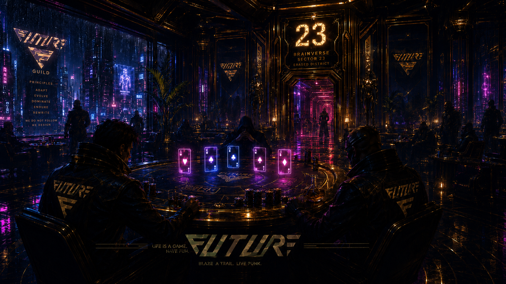

# CIRCUIT 23

> Brainverse Sector 23 - Underground Hold'em, hosted by FUTURE Guild.



NEOTOKYOPUNKS(NTP) 世界観の中に実在する「ポーカーハウス」として設計したWEBゲーム。
**都市計画から削除されたBrainverseの第23区画（Sector 23）。FUTUREギルドがアクセスコードを握って仕切り、PUNKS・ROARS・UTOPIA住人といった3コレクションのホルダー達と、Brainverse都市から流れ込むBV住人NPC、外から忍び込むゲスト訪問者まで、多種多様な層が入り乱れる深夜の遊戯場。**

> **Service Name**: `CIRCUIT 23`
> **Short**: `C-23`
> **Status**: 設計フェーズ (2026-05-19 〜)
> **Code Name / Repo**: `ntp-poker` (内部識別子)
> **Owner**: FUTURE Guild (NTPコミュニティ内ファンメイド)

## なぜ作るのか

- NTPコミュニティに「毎日触れる遊び場」がほしい
- ホルダー特典をゲームメカニクスに溶け込ませ、NFT保有の体験価値を上げる
- 将来的にFUTUREギルド独自のトークン経済（換金性なしのユーティリティ）に拡張する
- コミュニティドリブンの非公式プロダクトから出発し、認知獲得後に公式コラボへ

## ドキュメント一覧

| # | ファイル | 内容 |
|---|---|---|
| 01 | [overview](docs/01_overview.md) | ビジョン・ターゲット・差別化 |
| 02 | [requirements](docs/02_requirements.md) | 機能要件 / 非機能要件 |
| 03 | [game_spec](docs/03_game_spec.md) | ポーカールール・UIフロー・画面仕様 |
| 04 | [architecture](docs/04_architecture.md) | システム構成・技術選定理由 |
| 05 | [data_model](docs/05_data_model.md) | DBスキーマ・Colyseusステート・型定義 |
| 06 | [web3_integration](docs/06_web3_integration.md) | ウォレット接続・SIWE・NFT照会 |
| 07 | [holder_benefits](docs/07_holder_benefits.md) | NFTホルダー特典・ギルド別優遇 |
| 08 | [token_economy](docs/08_token_economy.md) | 将来トークン設計（Phase3） |
| 09 | [design_guidelines](docs/09_design_guidelines.md) | トンマナ・カラー・タイポ |
| 10 | [roadmap](docs/10_roadmap.md) | フェーズ別計画・マイルストーン |
| 11 | [legal_risks](docs/11_legal_risks.md) | 賭博罪リスク・IP利用・対策 |

## クイックスタート（実装着手時）

```powershell
# Phase1 着手時にこのコマンドで初期化する想定
pnpm create next-app@latest ntp-poker --typescript --tailwind --app
cd ntp-poker
pnpm add wagmi viem @rainbow-me/rainbowkit pokersolver zustand framer-motion
pnpm add -D @types/pokersolver
```

## フェーズサマリー

- **Phase 1** (2〜3週間): ソロモード（vs CPU 3人）、ウォレット接続、NFT照会、ローカルチップ
- **Phase 2** (3〜4週間): オンライン対戦（Colyseus、最大6人）、DB導入、ロビー・観戦
- **Phase 3** (4〜6週間): トークン経済、シーズン報酬、ホルダー限定イベント

## クレジット・免責

- **Fan-made project — Not affiliated with or endorsed by the official NEO TOKYO PUNKS team.**
- Inspired by the NEO TOKYO PUNKS universe (`0xa65ba71d653f62c64d97099b58d25a955eb374a0`)
- Built by community members of the FUTURE guild (NTP community)
- 公式IP・キャラクター画像の直接使用なし、トンマナのみ継承
- 公式コラボは Phase 1 完成後、動くデモを持って打診する方針
