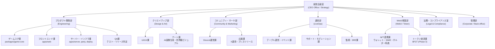

# 12. 事業化した場合の部署構造（Org Structure）

> CIRCUIT 23 を「一人＋Claude Code のプロジェクト」から「事業体」として見たときの組織設計。
> 架空の理想組織ではなく、**現在実際に発生している作業を部署に写像**したもの。
> この構造はそのまま Step2（ディレクトリ構造化）→ Step3（AI化）→ Step4（自動化）の単位になる。

## 12.1 設計方針

1. **部署 = 実作業の束**。いま手を動かしていない仕事のための部署は作らない
2. **各部署に「現在の担当」「AI化候補」「自動化候補」を明記**し、後続ステップの入力にする
3. 一人会社なので全部署の長は自分（プロダクトオーナー）。部署は「帽子の掛け替え」の単位

## 12.2 組織図

## 12.3 部署別の責務と現状マッピング

### ① 経営企画室（CEO Office / Strategy）

| 項目 | 内容 |
|---|---|
| 責務 | ビジョン策定、ロードマップ管理、KPI計測・判断、フェーズGo/No-Go、撤退条件の監視、公式コラボ打診の意思決定 |
| 対応ドキュメント | `docs/01_overview.md`, `docs/10_roadmap.md` |
| 現在の担当 | 自分 |
| 現在の手作業 | ロードマップ更新、KPI集計、優先順位判断 |
| AI化候補 (Step3) | KPIレポート自動生成、ロードマップ進捗の要約 |
| 自動化候補 (Step4) | 週次KPIダッシュボード自動更新・定期レポート配信 |

### ② プロダクト開発部（Engineering）

事業の中核。現在もっとも工数が集中している部署。

| 課 | 責務 | 対応コード |
|---|---|---|
| ゲームコア課 | ポーカールール、ベッティングFSM、ハンド評価、サイドポット、CPU AI | `packages/game-core` |
| フロントエンド課 | テーブルUI、ロビー、レスポンシブ、アニメーション、サウンド | `apps/web` |
| サーバー・インフラ課 | リアルタイム対戦サーバー、部屋管理、切断復帰、デプロイ（PartyKit / Fly / Railway / Vercel） | `apps/server`, `party/`, `fly.toml`, `railway.json`, `vercel.json` |
| QA課 | 単体テスト（カバレッジ80%目標）、ロードテスト、リリース判定、バグトリアージ | 各パッケージの tests |

| 項目 | 内容 |
|---|---|
| 現在の担当 | 自分 + Claude Code |
| 現在の手作業 | 機能実装、バグ修正、コードレビュー、デプロイ、動作確認 |
| AI化候補 (Step3) | 実装・レビュー・テスト生成のエージェント化（すでに一部Claude Code化済み） |
| 自動化候補 (Step4) | CI/CD（テスト→ビルド→デプロイ）、PR自動レビュー、リグレッション自動検知 |

### ③ クリエイティブ部（Design & Art）

| 課 | 責務 |
|---|---|
| UI/UX課 | 画面設計、ワイヤーフレーム、トンマナ管理（`docs/09_design_guidelines.md`） |
| アート課 | キービジュアル、テーブル背景・サムネイル等のAI画像生成、NTP世界観の継承（IPオリジナル範囲の管理） |

| 項目 | 内容 |
|---|---|
| 現在の担当 | 自分（AI画像生成活用） |
| 現在の手作業 | 画像生成プロンプト作成、生成物の選定・加工、UIへの組み込み |
| AI化候補 (Step3) | 画像生成パイプライン（プロンプトテンプレート＋バリエーション量産） |
| 自動化候補 (Step4) | アセット生成→最適化（圧縮・リサイズ）→配置のワンコマンド化 |

### ④ コミュニティ・マーケティング部（Community & Marketing）

| 課 | 責務 |
|---|---|
| Discord運営課 | FUTUREギルドDiscord運営、βテスター募集、フィードバック収集、ロールベースのアクセスGate |
| 広報課 | X (Twitter) 運用、プレスリリース、ローンチ告知、NTP公式への打診資料作成 |

| 項目 | 内容 |
|---|---|
| 対応ドキュメント | `docs/10_roadmap.md`（Phase 1.5 / 2.5 のタスク群） |
| 現在の担当 | 自分 + FUTUREギルドDiscord |
| 現在の手作業 | 告知文作成、フィードバックの読み込み・集約、テスター対応 |
| AI化候補 (Step3) | 告知文・パッチノート生成、フィードバックの自動分類・要約 |
| 自動化候補 (Step4) | リリース→パッチノート生成→Discord/X投稿の自動連携 |

### ⑤ 運営部（LiveOps）

Phase 2 以降に立ち上がる部署。オンライン対戦の「場」を回す。

| 課 | 責務 |
|---|---|
| テーブル運営・イベント課 | シーズンランキング、ホルダー限定イベント、トーナメント企画 |
| サポート・モデレーション課 | ユーザー問い合わせ、バンリスト、不正対応 |
| 監視・SRE課 | エラー監視（Sentry）、稼働監視、負荷対応、インシデント対応 |

| 項目 | 内容 |
|---|---|
| 現在の担当 | 自分（Phase 2 準備中） |
| AI化候補 (Step3) | 問い合わせ一次対応Bot、チャットログの不正・スパム検知 |
| 自動化候補 (Step4) | 死活監視アラート、シーズン集計・報酬配布の自動実行 |

### ⑥ Web3事業部（Web3 / Token）

| 課 | 責務 |
|---|---|
| NFT連携課 | ウォレット接続、SIWE認証、NFT照会（Alchemy）、ホルダー特典ロジック（`docs/06`, `docs/07`） |
| トークン経済課 | $FGT設計・実装、Treasury、エアドロ、ガバナンス（`docs/08`、Phase 3） |

| 項目 | 内容 |
|---|---|
| 現在の担当 | 自分 + Claude Code |
| AI化候補 (Step3) | 経済シミュレーション、コントラクトのセルフ監査補助 |
| 自動化候補 (Step4) | ホルダースナップショット定期取得、特典付与の自動反映 |

### ⑦ 法務・コンプライアンス室（Legal & Compliance）

| 項目 | 内容 |
|---|---|
| 責務 | 賭博罪リスク管理（換金性の排除を全部署に強制）、IP利用範囲の管理（ファンメイド範囲の逸脱チェック）、金商法/資金決済法（Phase 3前の弁護士確認）、利用規約・プライバシーポリシー |
| 対応ドキュメント | `docs/11_legal_risks.md` |
| 現在の担当 | 自分＋外部弁護士（Phase 3 前に必須） |
| AI化候補 (Step3) | 新機能の法務リスク一次スクリーニング（最終判断は弁護士） |
| 自動化候補 (Step4) | 「換金性を持つ機能」のPR時チェックリスト強制 |

### ⑧ 管理部（Corporate / Back-office）

| 項目 | 内容 |
|---|---|
| 責務 | コスト管理（月額 $0〜500 のインフラ費、`docs/10` §10.9）、契約管理（外注デザイン・弁護士・監査）、アカウント/シークレット管理 |
| 現在の担当 | 自分 |
| AI化候補 (Step3) | 月次コストレポート生成 |
| 自動化候補 (Step4) | インフラ費の予算超過アラート |

## 12.4 部署 × フェーズの稼働マトリクス

| 部署 | Phase 1 (ソロ) | Phase 2 (オンライン) | Phase 3 (トークン) |
|---|---|---|---|
| 経営企画室 | ● | ● | ● |
| プロダクト開発部 | ●●● | ●●● | ●● |
| クリエイティブ部 | ●● | ● | ● |
| コミュニティ・マーケ部 | ● | ●● | ●● |
| 運営部 | − | ●● | ●●● |
| Web3事業部 | ● (NFT連携) | ● | ●●● ($FGT) |
| 法務・コンプライアンス室 | ○ (随時) | ○ | ●● (必須) |
| 管理部 | ○ | ○ | ● |

●の数 = 相対的な工数比重。○ = 随時対応。− = 未稼働。

## 12.5 次のステップ

- **Step 2**: この部署構造を `company/` ディレクトリ構造として実体化（各部署ごとに責務定義・手順書・成果物置き場を持つ）
- **Step 3**: 「現在の手作業」欄のうち工数が大きいものから AI エージェント化（開発部のClaude Code活用が先行事例）
- **Step 4**: AI化した業務をトリガー（cron / CI / webhook）に接続して自動実行化
